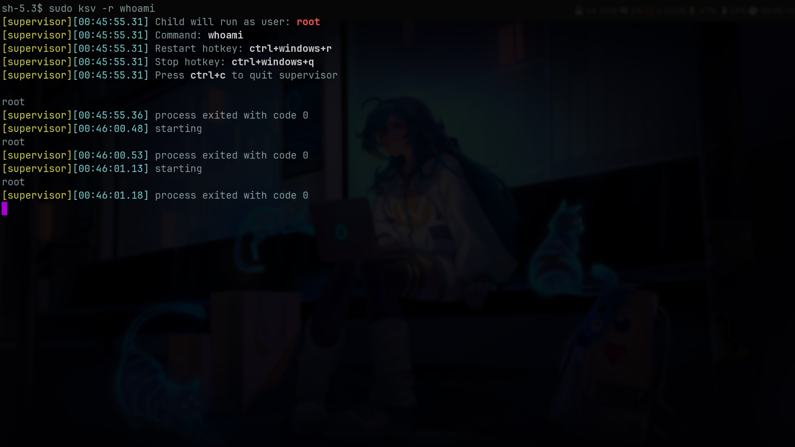

# KeyRestartSupervisor
KeyRestartSupervisor, or KeySupervisor(KSV) lets you run a command in the background and restart or stop it at any time using global hotkeys.

For example you can run `sudo ksv -r whoami` and restart the program multiple times using the keybiding.


**For a more realistic example:** lets say you wanted to run a python program you can do 
```bash
#sudo is required on linux to read keyboard inputs
sudo python ksv.py python main.py
```

The supervisor program will then be running main.py, you can then restart the program by hitting `windows+ctrl+r` or stop the program with `windows+ctrl+q`. When restarting, if the program was stopped because of forced termination with the quit hotkey or because it exited naturally, or crashed, it will start again. Otherwise, if the program is still running, it will be stopped and started again.

The child process will be run as your user unless you pass the -r flag then it will be ran with root privileges (Linux only), to see all available flags use the -h flag. 

## Why?
Some programmers use programs to reload their program whenever they save. I don't do this because I instinctively save in the middle of making changes to code a lot. While this isn't going to be a problem for most applications some that send notifications, deal with network traffic, or deal with managing keyboard events can be more problematic  to restart in a half-functional state. Hence the desire to have a separate keybinding to restart those programs easily without having to manually stop and restart the program.
## Installation
The way I installed the program is using my [dumb_insaller](https://github.com/Ben-Collett/dumb_installer) program, though you can feel free to install the program through whatever means you want. Just keep in mind this program needs root privlages to listen to keyboard inputs so you probably want to install it somewhere sudo can access it.

If you use dumb_installer the command to run the program will be ksv.

Note dumb_installer currently only works on Linux, so if your on another platform your on your own for now.

## LICENSING
The [keyboard](keyboard) module is licensed under the [MIT license](keyboard/LICENSE) and is copied from [py_keys](https://github.com/Ben-Collett/py_keys) a fork of [boppreh/keyboard](https://github.com/boppreh/keyboard)

The rest of the code is licensed under [BSD Zero](LICENSE)


